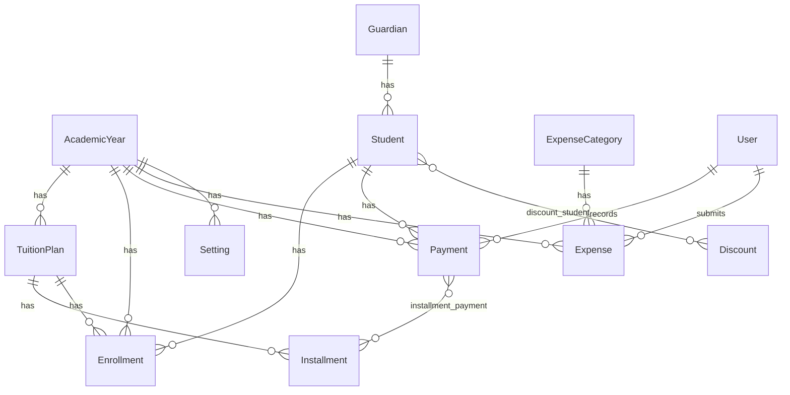

# 🏫 LamriBelaid — Private School Payment Management System (Algeria)

A secure, production-grade **online** web application purpose-built for Algerian private schools. LamriBelaid replaces manual or Excel-based tuition tracking with a modern, role-secured administration dashboard featuring full Arabic/French/English localization, automated Algerian tax calculations (TVA + Timbre Fiscal), and comprehensive financial reporting.

> **Project name:** LamriBelaid

---

## 📑 Table of Contents

- [Key Features](#-key-features)
- [Tech Stack & Core Packages](#-tech-stack--core-packages)
- [System Architecture](#️-system-architecture)
- [Data Model & Relationships](#-data-model--relationships)
- [Filament Administration Panel](#-filament-administration-panel)
- [Financial Engine](#-financial-engine)
- [CRM & Reporting Pages](#-crm--reporting-pages)
- [Import / Export Pipeline](#-import--export-pipeline)
- [Security & Access Control](#-security--access-control)
- [Localization & Regionalization](#-localization--regionalization)
- [PDF Receipt & Invoice Generation](#-pdf-receipt--invoice-generation)
- [Database Backup & Scheduling](#-database-backup--scheduling)
- [Testing Suite](#-testing-suite)
- [Project Structure](#-project-structure)
- [Getting Started](#-getting-started)
- [Environment Variables](#️-environment-variables)
- [License](#-license)

---

## ✨ Key Features

| Domain | Capabilities |
|---|---|
| **Student Management** | Full student registry with Arabic & Latin names, birth certificates, gender, enrollment history, guardian linking, restaurant (half-board) tracking |
| **Guardian Management** | Parent/guardian profiles linked to multiple students with contact details |
| **Academic Year Engine** | Multi-year support with `is_current` / `is_locked` flags, automatic exclusivity enforcement (only one current year at a time) |
| **Enrollment System** | Per-student, per-year enrollment records with level, grade, classroom, status, and tuition plan assignment |
| **Tuition Plans** | Configurable fee plans per grade with installment count and amount |
| **Installments** | Flexible installment schedules with type classification, due dates, sequence ordering, and restaurant fee (restauration) flags |
| **Payments** | Full payment lifecycle — amount HT, TVA, timbre fiscal, food fees, discounts, multi-installment allocation with pivot tracking |
| **Discounts** | Fixed or percentage discounts with per-installment-type applicability; many-to-many student assignment scoped by academic year |
| **Expense Tracking** | Categorized expenses with vendor, reference numbers, approval status, soft deletes, and academic year scoping |
| **Financial Reports** | Dashboard widgets for school summary, payment stats, monthly/yearly charts, financial report tables |
| **Income & Expenses Ledger** | Full monthly income vs. expense register with carry-over balance, founder withdrawal calculations, and XLSX export with French-formatted accounting sheets |
| **PDF Receipts** | Auto-generated payment receipts in A4 or thermal (80mm) format via DomPDF |
| **Excel Invoices** | Multi-student invoice generation as XLSX with detailed installment breakdowns |
| **CSV/XLSX Import** | Bulk student import from Ministry of Education CSV files with Arabic header auto-detection |
| **CSV/XLSX Export** | Generic export actions for any resource with BOM support, custom column mapping, and RTL-aware XLSX generation |
| **Automated Backups** | Scheduled daily MySQL database backups via `mysqldump` with 30-day retention |
| **Activity Logging** | Immutable audit trail on payments via Spatie Activitylog |
| **RBAC** | Role-based access control with `super-admin` and `accountant` roles, 75+ granular permissions across 15 models and 7 pages |

---

## 🚀 Tech Stack & Core Packages

| Layer | Technology | Version |
|---|---|---|
| **Framework** | Laravel | 13.x |
| **PHP** | PHP | ≥ 8.3 |
| **Admin Panel** | Filament (TALL Stack: Tailwind CSS, Alpine.js, Livewire) | 5.6+ |
| **Database** | MySQL | — |
| **PDF Engine** | Barryvdh/Laravel-DomPDF | 3.x |
| **Spreadsheets** | PhpOffice/PhpSpreadsheet | 5.x |
| **RBAC** | Spatie/Laravel-Permission | 8.x |
| **Audit Trail** | Spatie/Laravel-Activitylog | 4.x |
| **Language Switch** | Bezhansalleh/Filament-Language-Switch | 4.x |
| **Translations** | JoeDixon/Laravel-Translation | 1.x |
| **Dev: Seeding** | OrangeHill/iSeed | 3.x |
| **Dev: Testing** | PHPUnit | 12.x |
| **Build Tool** | Vite | — |

---

## 🏗️ System Architecture

The project enforces a strict **Service-Pattern Architecture** to keep controllers thin and logic testable:

```
app/
├── Console/Commands/       # Artisan commands (db:backup)
├── Filament/
│   ├── Actions/            # Reusable Filament actions (CSV/XLSX export, import, invoice)
│   ├── Exports/            # Filament exporter classes (8 model exporters)
│   ├── Forms/Components/   # Custom form components
│   ├── Imports/            # Filament importer classes (6 model importers)
│   ├── Pages/              # Custom Filament pages (Financial Reports, Income/Expenses, Unpaid Students)
│   │   └── Crm/            # CRM sub-pages (Payment Analytics, Monthly Report, Restoration Fees)
│   ├── Resources/          # 15 Filament CRUD resources + BaseResource
│   ├── Tables/Actions/     # Custom table actions
│   └── Widgets/            # 9 dashboard widgets (charts, stats, report tables)
├── Helpers/                # Utility classes (NumberToArabicWords, NumberToFrenchWords, ArabicGlyphs)
├── Http/
│   ├── Controllers/        # Slim controllers (Receipt PDF, Invoice Excel download)
│   ├── Middleware/          # SetLocaleMiddleware, EnsureFilamentUserHasRole
│   └── Requests/           # 12 Form Request validators (Store/Update for 6 models)
├── Models/                 # 12 Eloquent models
├── Policies/               # 15 authorization policies
├── Providers/              # Service providers
└── Services/               # 6 business-logic service classes
```

### Design Patterns Enforced

1. **Form Requests** — All backend validation rules reside in dedicated `app/Http/Requests` classes (Store + Update for Discount, Guardian, Installment, Payment, Student, TuitionPlan).
2. **Service Layer** — Business and calculation logic is abstracted into `app/Services`:
   - `PaymentCalculationService` — TVA, Timbre Fiscal, food fee, and discount calculations
   - `PaymentService` — Payment processing transactions and PDF receipt generation
   - `InvoiceExcelService` — Complex XLSX invoice generation with RTL/LTR support
   - `MonthlyPaymentsExcelService` — Monthly installment payment report sheets
   - `PaymentsReportExcelService` — Aggregated payment reporting
   - `RestorationFeesExcelService` — Restaurant fee tracking exports
3. **Policy Authorization** — Every resource has a dedicated policy enforcing RBAC at the model level.
4. **BaseResource Pattern** — All Filament resources extend a shared `BaseResource` that standardises the navigation group.

---

## 📊 Data Model & Relationships



### Models Overview (12 total)

| Model | Key Fields | Notes |
|---|---|---|
| `AcademicYear` | name, start_date, end_date, is_current, is_locked | Auto-enforces single current year via `saved` event |
| `Student` | identifier_number, names (AR + Latin), gender, DOB, birth certificate details, enrollment_number, uses_restaurant | Locale-aware `full_name` accessor; `class` accessor from current enrollment |
| `Guardian` | first_name, last_name, relationship, phone, email, address | HasMany students and payments |
| `Enrollment` | student_id, academic_year_id, tuition_plan_id, grade, level, classroom, status | Bridges student ↔ academic year ↔ tuition plan |
| `TuitionPlan` | name, grade, fee_amount, installment_count, active | Defines pricing per educational level |
| `Installment` | academic_year_id, tuition_plan_id, name, amount, type, due_date, sequence, uses_restauration | Many-to-many with Payment via pivot with allocated amounts |
| `Payment` | student_id, academic_year_id, user_id, receipt_number, payment_method, amount_ht, tva, timbre, food_fee, total, paid, currency, paid_at | Auto-generates monthly receipt numbers; logs all changes via Activitylog |
| `Discount` | name, type (fixed), value, active, applicable_installment_types | Scoped to current academic year via pivot |
| `Expense` | expense_category_id, reference_number, title, amount, expense_date, status, vendor_name, academic_year_id | SoftDeletes; auto-generates reference numbers; auto-assigns submitter |
| `ExpenseCategory` | name | Simple lookup table for expense classification |
| `Setting` | key, value, academic_year_id | Key-value config store (e.g., restaurant_fees, INTENDANTE, DIRECTEUR, FONDATEUR) |
| `User` | name, email, password | Implements `FilamentUser`; access gated by role/permissions |

---

## 🎛️ Filament Administration Panel

### CRUD Resources (15)

All resources are organized under the **"School Management"** navigation group via `BaseResource`:

| Resource | Model | Features |
|---|---|---|
| Students | `Student` | Full CRUD, CSV import action, guardian linking, enrollment history |
| Guardians | `Guardian` | Parent/guardian management with student relationships |
| Payments | `Payment` | Payment recording with auto-calculation, installment selection, receipt generation |
| Installments | `Installment` | Installment schedule management per tuition plan |
| TuitionPlans | `TuitionPlan` | Fee plan configuration per grade |
| Discounts | `Discount` | Discount rules with installment-type applicability |
| Enrollments | `Enrollment` | Student enrollment per academic year |
| AcademicYears | `AcademicYear` | Year management with current/locked toggles |
| Expenses | `Expense` | Expense recording with category, vendor, status |
| ExpenseCategories | `ExpenseCategory` | Expense classification labels |
| Users | `User` | User account management |
| Roles | `Role` | RBAC role management (Spatie) |
| Permissions | `Permission` | Granular permission management (Spatie) |
| ActivityLogs | `Activity` | Read-only audit log viewer |
| Settings | `Setting` | System configuration (restaurant fees, signatories) |

### Dashboard Widgets (9)

| Widget | Type | Description |
|---|---|---|
| `SchoolSummaryWidget` | Stats | Total students, enrollments, payments overview |
| `PaymentStatsWidget` | Stats | Payment totals, averages, counts |
| `MonthlyPaymentsChart` | Chart | Monthly payment trends visualization |
| `YearlyPaymentsChart` | Chart | Year-over-year payment comparison |
| `FinancialReportsTableWidget` | Table | Detailed per-student financial breakdown with unpaid balances |
| `PaymentsReportTable` | Table | Filterable payment report with date range and metric selection |
| `MonthlyPaymentsReportWidget` | Table | Installment-by-installment payment matrix per student |
| `RestorationFeesWidget` | Table | Monthly food/restaurant fee aggregation |
| `RestorationFeesChart` | Chart | Visual food fee trends |

---

## 💰 Financial Engine

### Tax Calculation (`PaymentCalculationService`)

The system implements the Algerian tax code for educational services:

```
TVA         = Amount_HT × 9% (configurable via TVA_RATE env)
Timbre      = (Amount_HT + TVA) × rate, where rate depends on Amount_HT:
                ≤ 30,000 DA  → 1.0%
                ≤ 100,000 DA → 1.5%
                > 100,000 DA → 2.0%
              * Timbre = 0 for CCP and Bank Transfer payments
Food Fee    = Configurable per-setting (default: 5,000 DA)
Total       = Amount_HT + TVA + Timbre + Food Fee − Fixed Discounts
```

### Multi-Installment Payment Allocation

Payments can span multiple installments. The `Payment` model includes sophisticated pivot-based allocation logic:

- **Proportional allocation** — Amounts are distributed across installments based on their expected amounts
- **Food fee allocation** — Restaurant fees are split only among installments flagged `uses_restauration`
- **Pivot sync** — `syncAllocatedAmountsToPivot()` persists calculated breakdowns to the `installment_payment` pivot table

### Currency

All amounts are in **Algerian Dinar (DA/DZD)**.

---

## 📈 CRM & Reporting Pages

### Custom Filament Pages (6)

| Page | Route | Description |
|---|---|---|
| **Financial Reports** | `/financial-reports` | Dashboard with school summary, payment stats, monthly/yearly charts, and detailed financial tables. Filterable by academic year. |
| **Unpaid Students** | `/unpaid-students` | Identifies students with outstanding balances. Filterable by academic year and classroom. |
| **Income & Expenses** | `/income-expenses` | Full monthly income vs. expense ledger following the Algerian academic calendar (September → August). Includes carry-over balances, founder withdrawal calculations (rounded to nearest 10,000 DA), and XLSX export with formal French accounting layout. |
| **Payment Analytics** | `/payment-analytics` | Advanced analytics with date range filtering and metric toggle (Paid, Amount HT, TVA, Timbre, Food Fee, Total). |
| **Monthly Payments Report** | `/monthly-payments-report` | Per-student installment payment matrix with class filtering and XLSX export. |
| **Restoration Fees** | `/restoration-fees` | Restaurant/food fee tracking with monthly aggregation, CSV export, and XLSX export. |

---

## 📥 Import / Export Pipeline

### Import

- **Student CSV Import** (`ImportStudentsCsvAction`) — Imports student data from Ministry of Education CSV files with:
  - Automatic Arabic header detection (dynamic header row finding)
  - Full Arabic → DB value mapping (gender: ذكر→M, grade: ابتدائي→AP, etc.)
  - BOM handling for UTF-8 files
  - Automatic enrollment creation for the selected academic year
  - Tuition plan derivation from grade
  - `updateOrCreate` to avoid duplicates (keyed on `identifier_number`)

- **Filament Importers** (6) — Built-in Filament import support for: Discount, Guardian, Installment, Payment, Student, TuitionPlan

### Export

- **Filament Exporters** (8) — Built-in Filament export support for: Discount, Expense, FinancialReport, Guardian, Installment, Payment, Student, TuitionPlan
- **Custom CSV Export** (`CsvExportAction`) — Generic CSV export with BOM support, custom column mapping, and chunked streaming
- **Custom XLSX Export** (`XlsxExportAction`) — Generic XLSX export with RTL sheet direction, auto-column sizing, and prepend rows
- **Invoice XLSX** (`SaveInvoiceAction` + `InvoiceExcelService`) — Multi-student invoice generation with installment breakdowns
- **Monthly Payments XLSX** (`MonthlyPaymentsExcelService`) — Detailed installment payment report per student
- **Restoration Fees XLSX** (`RestorationFeesExcelService`) — Monthly food fee aggregation export
- **Income & Expenses XLSX** — Full monthly register with formal French accounting layout and digital signatures

---

## 🔒 Security & Access Control

### Roles

| Role | Scope |
|---|---|
| `super-admin` | Full access to all 75+ permissions across all models, pages, and settings |
| `accountant` | CRUD on students, payments, discounts, installments, expenses + access to all financial/CRM pages (no settings, users, roles, or permissions management) |

### Permission Model

Permissions follow the pattern `{action}_{model}` with 5 actions per model:
- `view_any`, `view`, `create`, `update`, `delete`

**15 models** × **5 actions** = **75 resource permissions** + **7 page-level permissions**:
- `view_page_payment_analytics`
- `view_page_financial_reports`
- `view_page_unpaid_students`
- `view_page_income_expenses`
- `view_page_settings`
- `view_page_monthly_payments_report`
- `view_page_restoration_fees`

### Middleware

- `SetLocaleMiddleware` — Applies the user's selected locale from session
- `EnsureFilamentUserHasRole` — Guards Filament panel access

### Panel Access Gate

Users can access the Filament panel only if they have the `super-admin` role **or** at least one permission assigned.

---

## 🌍 Localization & Regionalization

### Languages

| Language | Direction | Status |
|---|---|---|
| **Arabic (العربية)** | RTL | Full translation (16KB+ translation file) |
| **French (Français)** | LTR | Full translation (14KB+ translation file) |
| **English** | LTR | Full translation (13KB+ translation file) |

Runtime language switching is provided natively in the Filament panel via `bezhansalleh/filament-language-switch`.

### Regional Settings

- **Timezone:** `UTC+1` (Algeria Local Time) for all transactions and system logs
- **Currency:** Algerian Dinar (DA / DZD)
- **Number-to-Words Helpers:**
  - `NumberToArabicWords` — Converts amounts to Arabic words (e.g., `193700.00` → `مائة وثلاثة وتسعون ألف وسبعمائة دينار جزائري وصفر سنتيم`)
  - `NumberToFrenchWords` — Converts amounts to French words for formal accounting documents
- **Arabic Glyphs Helper** — Handles Arabic glyph shaping for PDF rendering where native RTL support is limited

---

## 🧾 PDF Receipt & Invoice Generation

### Payment Receipts

Generated via `PaymentService::generateReceipt()` using Barryvdh/Laravel-DomPDF:
- **A4 format** — Standard portrait layout
- **Thermal format** — 80mm width thermal printer paper (226.77pt)
- Receipts include student name, installment details, payment breakdown (HT, TVA, Timbre, Food Fee), and auto-generated receipt number (monthly counter, zero-padded to 3 digits)

### Excel Invoices

Generated via `InvoiceExcelService` and downloadable through `InvoiceExcelController`:
- Multi-student, multi-payment invoice bundling
- Per-installment amount breakdown
- Downloadable as `.xlsx` via authenticated route

---

## 💾 Database Backup & Scheduling

### Automated Backups

```bash
# Manual backup
php artisan db:backup

# Scheduled: runs daily at 16:00 (configured in routes/console.php)
```

- Uses `mysqldump` for reliable MySQL backups
- Stores backups in `storage/app/backups/`
- **Auto-cleanup:** Deletes backup files older than 30 days
- **Timeout:** 5-minute max execution time per backup

---

## 🧪 Testing Suite

Run the full test suite:

```bash
php artisan test
# or
composer test
```

### Test Coverage

| Test File | Coverage Area |
|---|---|
| `FilamentPagesLoadTest` | Validates all Filament resources, pages, and widgets load with HTTP 200 |
| `AuthAndReceiptTest` | Authentication flows and payment receipt generation |
| `PaymentServiceTest` | Payment processing and calculation service logic |
| `InvoiceExcelServiceTest` | Invoice XLSX generation and data integrity |
| `FinancialReportsTableWidgetTest` | Financial report widget data accuracy |
| `ExportActionsTest` | CSV/XLSX export action functionality |
| `ExampleTest` | Basic application smoke test |

All tests are located in `tests/Feature/`.

---

## 📁 Project Structure

```
lamribelaid/
├── app/
│   ├── Console/Commands/           # db:backup Artisan command
│   ├── Filament/
│   │   ├── Actions/                # 4 custom actions + Traits
│   │   ├── Exports/                # 8 exporter classes
│   │   ├── Forms/Components/       # Custom form components
│   │   ├── Imports/                # 6 importer classes
│   │   ├── Pages/                  # 3 top-level pages + 3 CRM sub-pages
│   │   ├── Resources/             # 15 CRUD resources + BaseResource
│   │   ├── Tables/Actions/         # Custom table actions
│   │   └── Widgets/                # 9 dashboard widgets
│   ├── Helpers/                    # NumberToArabicWords, NumberToFrenchWords, ArabicGlyphs
│   ├── Http/
│   │   ├── Controllers/            # 2 controllers + base
│   │   ├── Middleware/             # SetLocale, EnsureFilamentUserHasRole
│   │   └── Requests/              # 12 Form Request validators
│   ├── Models/                     # 12 Eloquent models
│   ├── Policies/                   # 15 authorization policies
│   ├── Providers/                  # Service providers
│   └── Services/                   # 6 business-logic services
├── config/
│   ├── payment.php                 # TVA rate configuration
│   ├── filament.php                # Filament panel config
│   └── ...                         # 18 additional config files
├── database/
│   ├── migrations/                 # 26 migration files
│   └── seeders/                    # 13 seeder classes (with real demo data)
├── resources/
│   ├── lang/                       # ar.json, fr.json, en.json + vendor translations
│   └── views/                      # Blade templates (receipts, PDF, Filament pages)
├── routes/
│   ├── web.php                     # Web routes (locale switch, receipt, invoice download)
│   └── console.php                 # Scheduled tasks (daily backup at 16:00)
└── tests/
    └── Feature/                    # 7 feature test files
```

---

## 🚀 Getting Started

### Prerequisites

- **PHP** ≥ 8.3
- **Composer** ≥ 2.x
- **Node.js** ≥ 18.x with npm
- **MySQL** ≥ 8.0
- **mysqldump** (for database backups)

### Quick Setup

```bash
# 1. Clone the repository
git clone <repository-url> lamribelaid
cd lamribelaid

# 2. Run the automated setup (installs dependencies, generates key, runs migrations, builds assets)
composer setup

# 3. Seed the database with demo data
php artisan db:seed

# 4. Start the development server (launches PHP server + queue + logs + Vite concurrently)
composer dev
```

The `composer dev` command starts 4 concurrent processes:
- 🔵 **Server** — `php artisan serve`
- 🟣 **Queue** — `php artisan queue:listen --tries=1 --timeout=0`
- 🔴 **Logs** — `php artisan pail --timeout=0`
- 🟠 **Vite** — `npm run dev`

### Default Accounts

| Role | Email | Password |
|---|---|---|
| Super Admin | `admin@example.com` | `password` |
| Accountant | `aya@example.com` | `password` |

---

## ⚙️ Environment Variables

Key environment variables to configure:

| Variable | Default | Description |
|---|---|---|
| `TVA_RATE` | `0.09` | VAT rate for payment calculations (9%) |
| `DB_CONNECTION` | `mysql` | Database driver |
| `DB_DATABASE` | — | MySQL database name |
| `DB_USERNAME` | — | MySQL username |
| `DB_PASSWORD` | — | MySQL password |
| `APP_TIMEZONE` | `UTC+1` | Application timezone (Algeria) |

---

## 📄 License

This project is proprietary software developed for private school administration in Algeria.